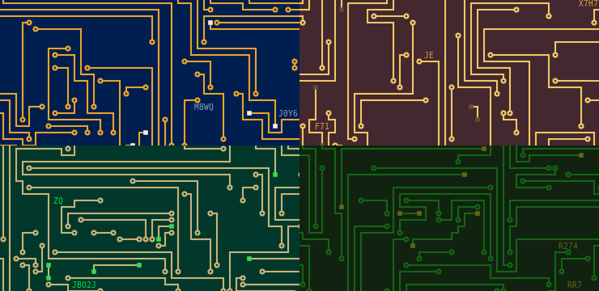

# This repository has been moved to [gitlab.com/paul-nechifor/circuit-boards](http://gitlab.com/paul-nechifor/circuit-boards).

Old readme:

# Circuit Boards

A Node package for generating seamless tiles that resemble circuit boards. You
can [play with the settings][site] on my web site or just clone this.



I'll be using this in a game I'm developing.

## Examples

A basic example:

```coffeescript
Canvas = require 'canvas'
{draw} = require 'circuit-boards'
fs = require 'fs'

canvas = new Canvas
opts =
  size: 128
stopDraw = draw canvas, opts, ->
  out = fs.createWriteStream __dirname + '/text.png'
  stream = canvas.pngStream()
  stream.on 'data', (chunk) -> out.write chunk
  stream.on 'end', -> console.log 'saved'

# Stop early. The draw callback isn't called.
#setTimeout (-> stopDraw ->), 1000
```

Generate an image for all the styles:

    coffee examples/doAll.coffee

## License

MIT

[site]: http://nechifor.net/circuits
